# 1. Qué es un navegador y qué es HTML?
## Introducción
Los navegadores son programas/aplicaciones de ordenador/movil que son capaces de leer archivos web ([.html](https://www.w3schools.com/tags/default.asp), [.php](https://www.w3schools.com/php/php_ref_overview.asp), etc.). Estos archivos web son los que contienen el código que conforma una página web.

La forma en la que funciona es que el navegador lee el archivo y todo su código, lo interpreta de una forma especifica usando una especificación (en este caso [HTML5](https://www.w3.org/TR/2011/WD-html5-20110405/), que no es más que un set de instrucciones de como interpretar el código html) y lo convierte en elementos visibles e interactuables:

!!! Interpretado Example inline end
    <div class="html-doc">
      <button> Esto es un botón </button>
    </div>
``` html title="Código html"
<button> Esto es un botón </button>
```


### Archivo HTML

La forma más básica de generar una web es mediante un archivo .html, cuya forma más sencilla es la siguiente:

``` html title="Plantilla básica de html"

<!DOCTYPE html> <!--(1)!-->
<html lang="es"> <!--(2)!-->

  <head> <!--(3)!-->
    <meta charset="utf-8"> 
    <title>Mi página Web</title>
  </head>

  <body> <!--(4)!-->
    <p>Buenas, estoy escribiendo un párrafo de texto.</p>
  </body>

</html>

```

1.  Esto es necesario para que el navegador entienda que es un documento html
2.  El resto del documento ha de estar dentro de esta "etiqueta" html
3.  Los documentos html tienen 2 secciones claras. el `<head>` y el `<body>`. En el [<head\>](#head) se incluye información visible y entendible para el navegador sobre la web.
3.  Los documentos html tienen 2 secciones claras. el `<head>` y el `<body>`. En el [<body\>](#body) se incluye todo lo que verá el usuario.

!!! Interpretado Example
    <div class="html-doc">
      <p>
        Buenas, estoy escribiendo un párrafo de texto.
      </p>
    </div>

Los documentos html tienen 2 secciones claras. el `<head>` y el `<body>`. 

En el [<head\>](../2-elementos-html#head) se incluye información visible y entendible para el navegador sobre la web.

En el [<body\>](../2-elementos-html#body) se incluye todo lo que verá el usuario.

### Iniciar proyecto Web

Para empezar un proyecto, simplemente has de ir a alguna carpeta de tu ordenador, normalmente los proyectos es bueno ponerlos en una carpeta nueva llamada "Proyectos" la carpeta "Documentos" de Windows:

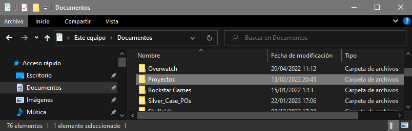

Dentro, crea otra carpeta con el nombre que quieras ponerle al proyecto.

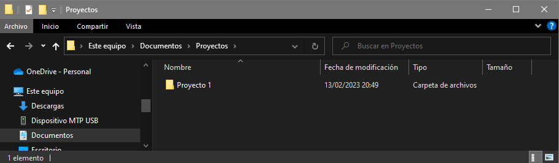

Aquí es donde pondremos todos los archivos relevantes para un proyecto. 

Lo primero que has de saber a la hora de hacer un proyecto html es el nombre que han de tener algunos archivos.

Por razones que explicaremos luego, es buena práctica que la página principal sea un archivo llamado "index.html". 

__ANTES DE CONTINUAR. AHORA QUE VAS A SER UN DESARROLLADOR__, tienes que activar una opción en tu navegador de archivos:

En Windows 10 tienes que ir a la pestaña de __"Vista"__, hacer click en __"Opciones"__ y a la opción de __"Cambiar opciones de carpeta y busqueda"__. Saldrá una nueva ventana, aquí haz click en la pestaña __"Ver"__ y busca y __DESHABILITA__ la opción __"Ocultar las extensiones de archivo para tipos de archivo..."__.

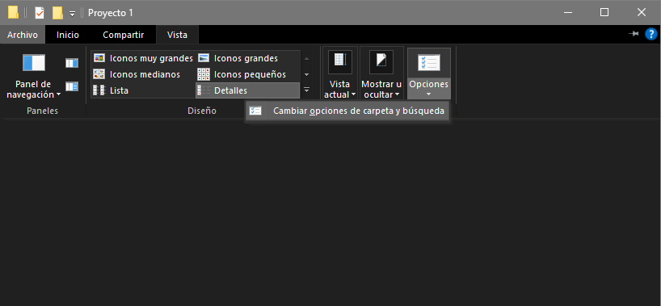

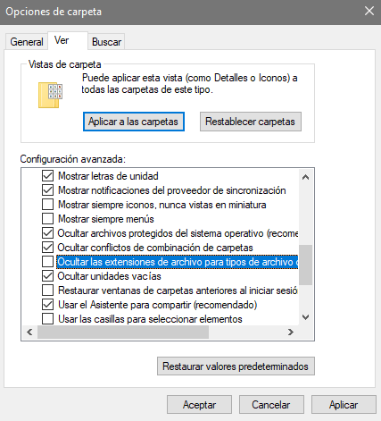

Esto te permitirá cambiar los tipos de archivos de los archivos de tu ordenador, algo necesario para los desarrolladores. TEN CUIDADO A PARTIR DE AHORA, ya que cuando quieras cambiar el nombre de archivo de cualquier archivo de tu ordenador puede que borres sin querer el tipo de archivo y el archivo no pueda leerse. Pero no te preocupes, el Sistema Operativo ya toma medidas para que te asegures de que no haces pifias como solo resaltar el nombre de archivo y no la terminación cuando cambias un nombre de archivo y si detecta que quieres cambiar la terminación te dará un aviso. Ahora mismo lo podrás compobrar:

__CONTINUEMOS__

Podemos crear el primer archivo del proyecto nosotros mismos en esta carpeta de proyecto haciendo click derecho en la carpeta > Nuevo > Documento de texto

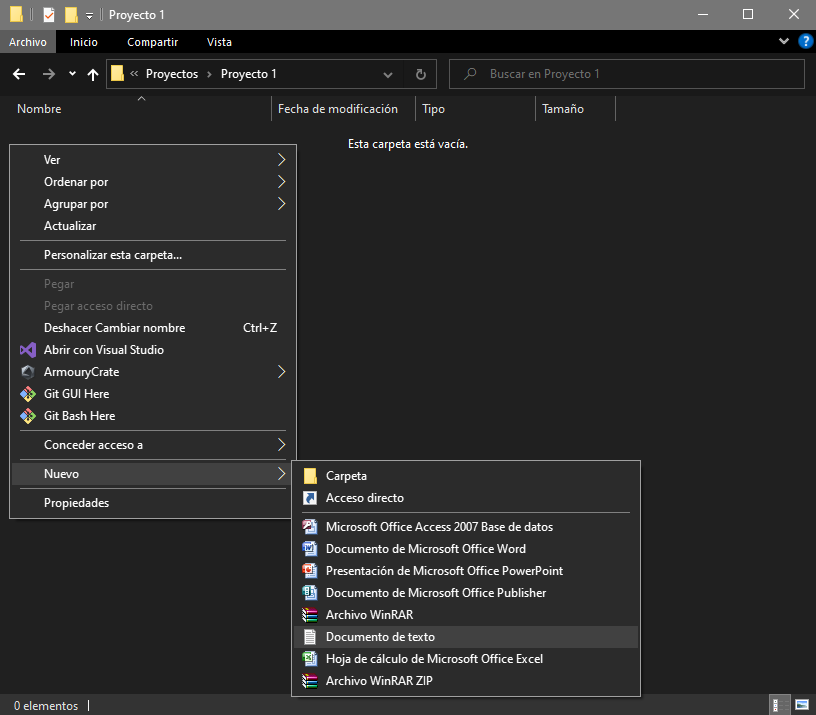

Y aquí se creará un archivo .txt que podremos cambiar el nombre ENTERO a index.html. Te saltará un aviso de que si quieres cambiar el tipo de archivo y bla bla bla... ¡SI QUE QUIERES! ¡A LA LOCURA!

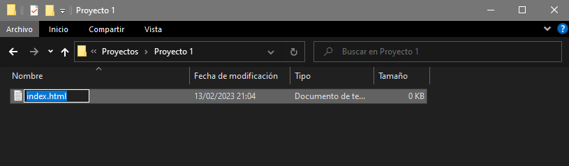

Una vez hecho esto podriamos abrir el archivo haciendo click derecho en él y abrirlo con el bloc de notas... Pero esto es cutre a más no poder (Yo empecé programando en un editor de texto llamado notepad++ que se puede descargar desde internet. Pero era un novato, muy vago para buscar mejores alternativas y no era conocedor de los maravillosos IDE)

__Editores de código: IDE (Integrated Development Environment)__

Los IDE son editores de texto pero diseñador para código, basicamente son como el bloc de notas pero con MUCHISIMAS más herramientas y funcionalidades para facilitar tu vida.

El standard en la industria y que además es gratuito es el VS Code de Microsoft.

[Descargalo desde este link](https://code.visualstudio.com/)

Una vez instalado podemos empezar con el proyecto.

Abrimos VS Code y después de todas las introducciones nos dará unas opciones. Le hacemos click a "Open Folder" y seleccionaremos la carpeta de proyecto en la que está "index.html" que creamos anteriormente

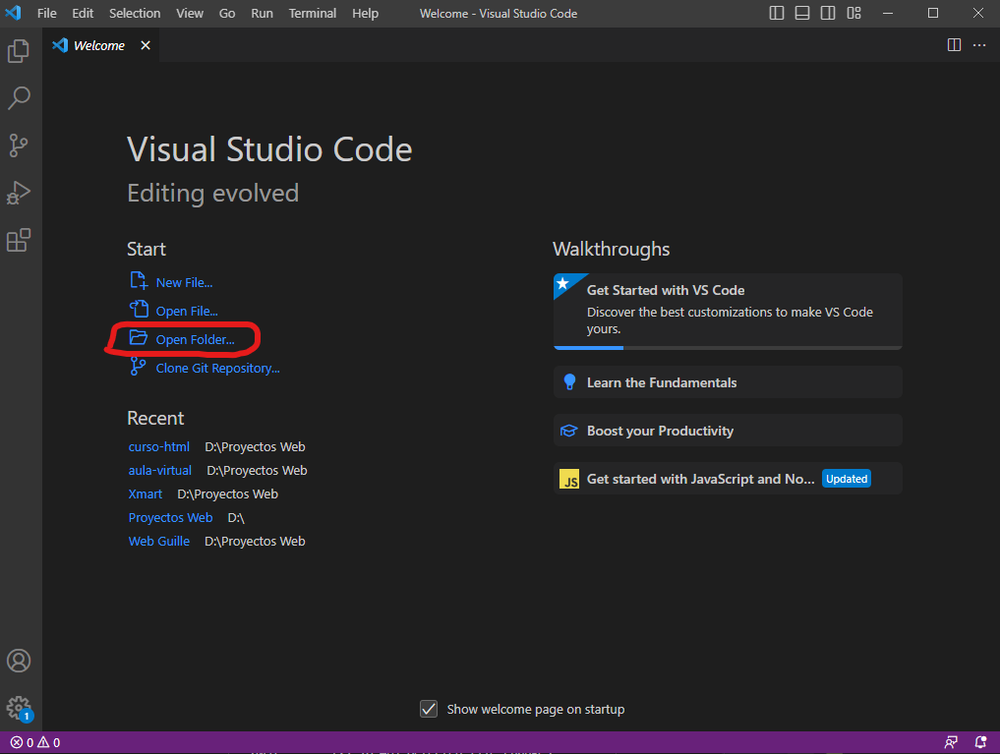
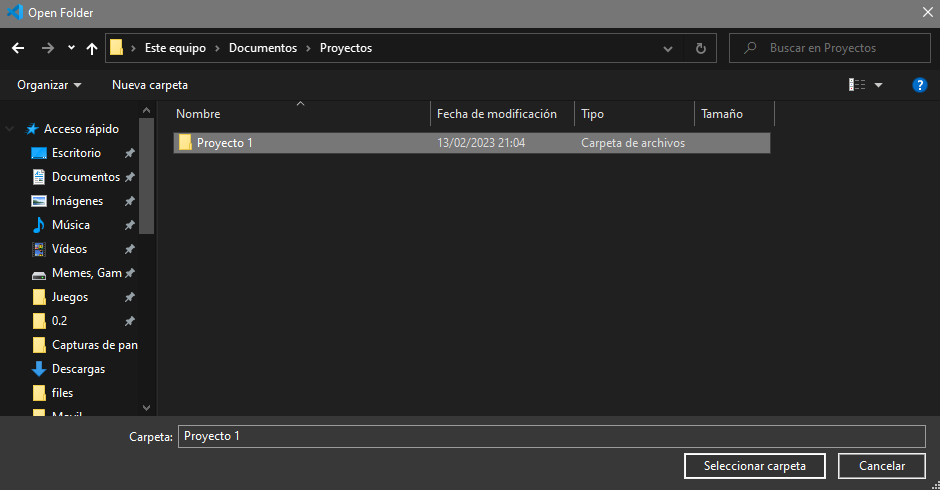

Normalmente te pedira que confirmes si confias en los autores de este proyecto. Acerpta haciendo click en el botón azul.
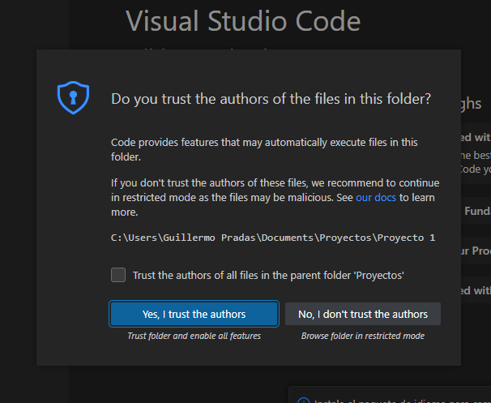

Una vez aquí verás diferentres zonas. A la izquierda del todo tendrás la barra de secciones y funcionalidades. Por el momento solo tienes que conocer las primeras dos, el documento y la lupa. El primero te permite ver los archivos de tu proyecto (En este caso solo tenemos index.html), la lupa te permite buscar una palabra o texto a lo largo de todos los archivos del proyecto.
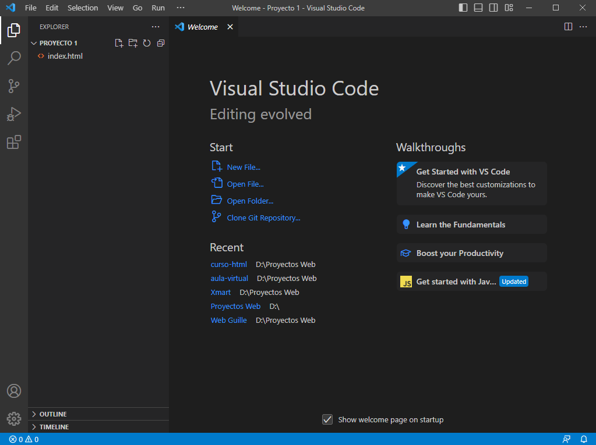

Empezaremos haciendo click en el archivo index.html de la izquierda, esto lo abrirá en el editor.
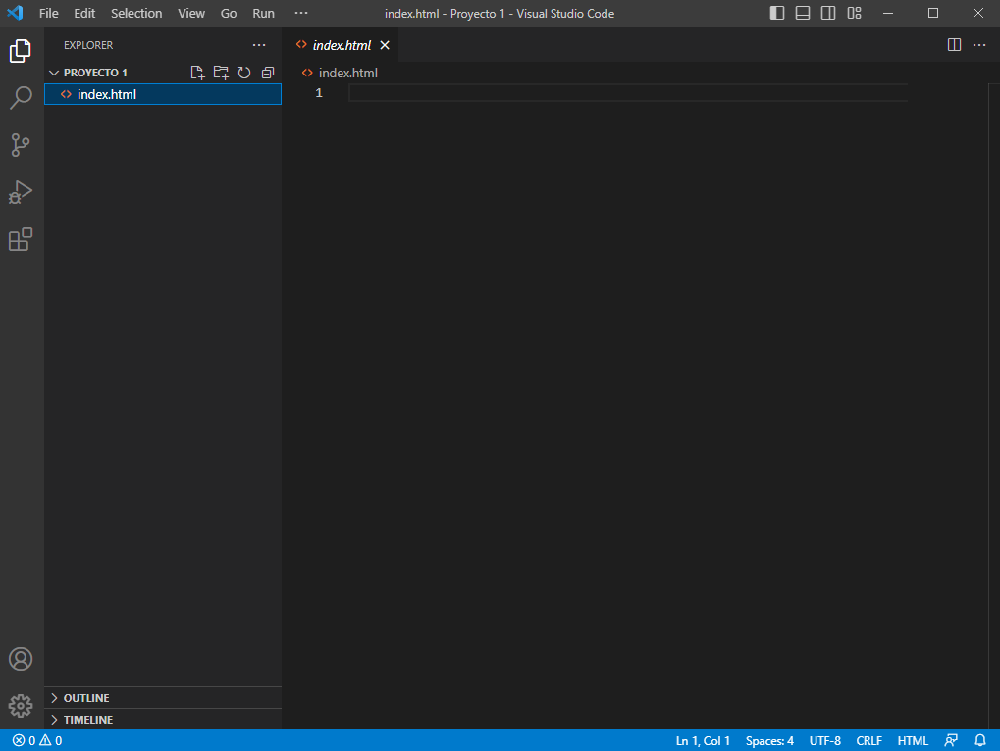

Como verás, está vacio. Vamos a cambiar esto, copia y pega este codigo, es la plantilla html que te puse arriba, copialo TODO y pegalo en el editor de código. CUando acabes guarda el archivo presionando CTRL + S

``` html title="Plantilla básica de html"

<!DOCTYPE html>
<html lang="es">

  <head>
    <meta charset="utf-8"> 
    <title>Mi página Web</title>
  </head>

  <body>
    <p>Buenas, estoy escribiendo un párrafo de texto.</p>
  </body>

</html>

```
Una vez hecho, ya tenemos nuestra primera página web. Para poder verla en el navegador, solo tenemos que ir a la carpeta del proyecto y hacer doble click en "index.html". 
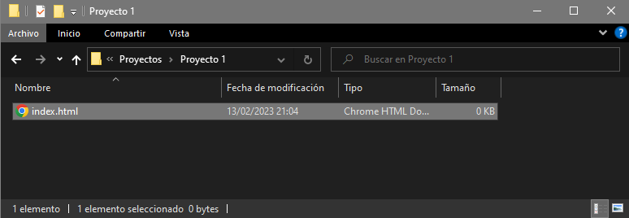
Debería tener el icono de tu navegador preferido a la izquierda, si no es asi solo haz click derecho sobre este: Selecciona "Propiedades" > "Se abre con:" y cambia este campo por tu navegador preferido. Acepta, vuelve y haz doble click. 

Tu navegadoir debería abrirse y deberias ver esto:
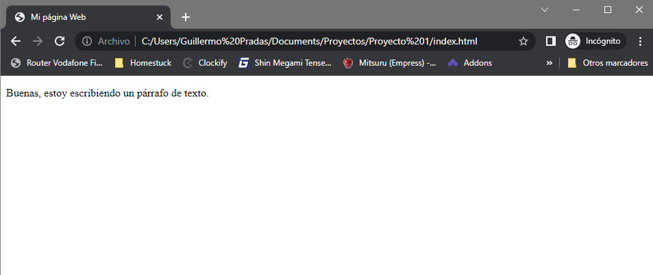

Y así se monta tu proyecto HTML!

### Expansión: Servidores y PHP
__Servidores__, las máquinas que albergan el codigo y nos permiten ver las webs.

Verás, cuando vemos una página como google, en realidad nos estamos conectando directamente a un ordenador en alguna parte del mundo. Este ordenador ha permitido y ha abierto una puerta especifica para que los navegadores entren. A los navegadores, cuando entran por la puerta, se les proporciona unos archivos para que sean leidos por el navegador, el navegador entonces lee estos archivos como un conjunto y los muestra en forma de página web para nosotros.

Estos ordenadores se conocen como __"servidores"__, los servidores son simplemente torres de PC configurados y creados para contectarse a internet y permitir la lectura y escritura de datos en ellos por otros usuarios y ordenadores.

Hay un mundo y una infinidad de formas en las que los servidores estan configurados y todos varian mucho en como están montados, lo que quiere decir que la forma en la que dan archivos y comunican información con los navegadores (e incluso otras aplicaciones como juegos), variará de gran forma.

Aun así, hay varios standards con respecto a esto y prácticas comunes. Un método muy utilizado desde hace muchos años y que se considera la forma "standard" de suministrar a navegadores con los archivos necesarios para mostrar una página web es conocida como

Normalmente, por como funcionan algunos servidores, estos para abrir una dirección entre las carpetas y archivos de la web, van a buscar leer por defecto un archivo llamado __"index.html"__
