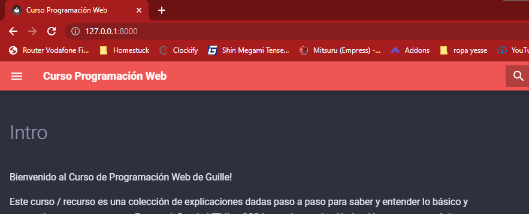

# 2. Elementos HTML básicos

## Introducción
Un archivo HTML se conforma constantemente de estos elementos que ya has visto: `<html>`.

Estos elementos se conocen como {==__etiquetas__==}, {==__tags__==} o {==__elementos__==}. 

Los elementos son etiquetas que se __abren__ y se __cierran__ en la mayoría de casos. Una vez se abren, introduces contenido en ellos y cuando has acabado, los cierras.

``` html title="Código html"
<p> <!--(1)!-->
  He abierto un párrafo y estoy escribiendo un texto y cuando se acabe el texto, cerraré el párrafo: 
</p> <!--(2)!-->
```

1.  De esta forma abres un elemento html
2.  Y se cierra añadiendo el caracter / al principio
!!! Interpretado Example
    <p class="html-doc"> He abierto un párrafo y estoy escribiendo un texto y cuando se acabe el texto, cerraré el párrafo: </p>

### Atributos

Los [atributos]() son caracteristicas o propiedades que un elemento html puede tener. Definen diferentes caracteristicas e información opcional y en algunos casos necesaria para el funcionamiento de los elementos.

Un ejemplo de un atributo necesario es el "href", utilizado para los elementos `<a>`, los links. Define a qué página iras una vez hagas click en el link:
!!! Interpretado Example inline end
    <div class="html-doc" style="padding:26px">
      <a style="color:blue" href="https://google.com">Este Link te llevará a Google</a>
    </div>
``` html title="Código html"
    <!--(1)!-->
<a href="https://google.com">
  Este Link te llevará a Google
</a>
```

1.  Este es un atributo

Hay unos atributos que pueden asignarse a todos los elementos y que puede ayudar a identificarlos. Esto será más relevante en un futuro, pero ahora solo los mencionaré brevemente.

#### id

Los id son __identificadores únicos__ para un elemento, esto quiere decir que un elemento debería tener un solo id y ningún otro elemento debería tener uno igual.

``` html title="Código html"
<div id="titulo"> Este elemento tiene el id "titulo" </div>
<div id="texto"> Este elemento tiene el id "texto" </div>
```

#### class

Las class son __identificadores duplicables__ para uno o varios elemento, esto quiere decir que: 
1) Más de un elemento puede tener la misma clase 
2) Un elemento puede tener más de una clase.

Has de pensar en las class como poner un elemento en categorias o grupos.

En este ejemplo ponemos cada elemento con el nombre de animal  con una class correspondiente a su orden animal:
``` html title="Código html"
<div class="canino"> Perro </div>
<div class="felino"> Gato </div>
<div class="felino"> Tigre </div>
<div class="felino"> Pantera </div>
<div class="primate"> Humano </div>
<div class="primate"> Gorila </div>
```


### Los elementos

Hay un [MONTÓN de elementos html](https://www.w3schools.com/TAGS/default.asp) con diferentes funciones. Pero solo explicaré los más necesarios y usados junto con ejemplos. 

Los dividiremos en las 2 secciones, `<head>` y `<body>`, empezando por body ya que son los más visibles.

## Body
El body es el "cuerpo" de la web, es donde se escribe el contenido que verá el usuario. Tienes a tu disposición un montón de elementos para lo grar lo que tengas en la cabeza:

### div
El [<div\>](https://www.w3schools.com/TAGS/tag_div.asp) significa "divisor", es el elemento más básico, piensa en él como una __caja__ en la que puede ir lo que quieras:
!!! Interpretado Example inline end
    <div class="html-doc"> Esto es una caja, un div </div>
``` html title="Código html"
<div> Esto es una caja, un div </div>
```

### h1 a h6
Los [<hN\>](https://www.w3schools.com/TAGS/tag_hn.asp) son "headers" o "títulos", sirven para encabezar secciones de la web.

Los disponibles son: `<h1> <h2> <h3> <h4> <h5> <h6>` y van de más grandes a más pequeños.

Estos elementos vienen con márgenes inferiores por defecto, te ayudarán a separar lo que haya debajo de ellos.


``` html title="Código html"
<h1>
  Esto es un título grande
</h1> 

<h2>
  Uno más pequeños
</h2> 

<h3>
  Aun más pequeño
</h3> 

<h4>
  Chiquito
</h4>

<h5>
  Chiquitito
</h5> 

<h6>
  Diminuto
</h6> 
```
!!! Interpretado Example
    <div class="html-doc"> 
      <h1>
        Esto es un título grande
      </h1> 
      <h2>
        Uno más pequeños
      </h2> 
      <h3>
        Aun más pequeño
      </h3> 
      <h4>
        Chiquito
      </h4>
      <h5>
        Chiquitito
      </h5> 
      <h6>
        Diminuto
      </h6> 
    </div>
    

### p
El elemento [<p\>](https://www.w3schools.com/TAGS/tag_p.asp) significa "párrafo", sirve para escribir textos. Este viene con un margen superior e inferior por defecto que ayuda a separar el bloque de texto de otros elementos.

Una nota! si usas la etiqueta `<br/>` harás un salto de linea! Ten en cuenta que esta se cierra a si misma. Solo deberias usarla dentro del elemento `<p>`

``` html title="Código html"
                                                                            <!--(1)!-->
<div> Esto es un div, como antes, pero no cuento con margenes, asi que el &lt;p&gt; es quien me separa</div>
<p> 
  Esto es un parrafo de texto, podría continuar y continuar y continuar, pero mejor que acaber ya. 
  <br/>
  Ah mira! he hecho unsalto de linea! 
</p>
```

1. Estos caracteres son [codigos de entidad html](https://entitycode.com/#featured-content), sirven para escribir < y > sin que el navegador los interprete como un elemento html. Abajo verás que se muestran como esos simbolos sin abrir un elemento <p\>
!!! Interpretado Example
    <div class="html-doc">
        <div> Esto es un div, como antes, pero no cuento con margenes, asi que el &lt;p&gt; es quien me separa</div>
        <p> 
          Esto es un parrafo de texto, podría continuar y continuar y continuar, pero mejor que acaber ya. 
          <br/>
          Ah mira! he hecho unsalto de linea! 
        </p>
  </div>


### strong, i
[<strong\>](https://www.w3schools.com/TAGS/tag_strong.asp) e [<i\>](https://www.w3schools.com/TAGS/tag_i.asp) son elementos con los que podemos poner en negrita y poner en cursiva ciertas secciones de texto respectivamente.

``` html title="Código html"
¿Quiero ser <strong>fuerte</strong> o <i>tener estilo</i>?
```
!!! Interpretado Example
    <div class="html-doc">
      ¿Quiero ser <strong>fuerte</strong> o <i>tener estilo</i>?
    </div>

### a
Los [<a\>](https://www.w3schools.com/TAGS/tag_a.asp) son los __links__. Si haces clicks en ellos, te llevarán a otra página. El atributo `href` define a donde te llevará el link.


``` html title="Código html"
Si quieres ir a Google.com, <a href="https://google.com">Haz click justo aquí</a>
```
!!! Interpretado Example
    <div class="html-doc" style="padding:26px">
      Si quieres ir a Google.com, <a style="color:blue" href="https://google.com">Haz click justo aquí</a>
    </div>

Puedes controlar si el link se abrirá en la misma pestaña o en una nueva usando el atributo `target` y definiendolo como `_blank`
``` html title="Código html"
Si haces <a href="https://google.com" target="_blank">click en este link</a>, Google.com se abrirá en una nueva pestaña.
```
!!! Interpretado Example
    <div class="html-doc" style="padding:26px">
      Si haces <a style="color:blue" href="https://google.com" target="_blank">click en este link</a>, Google.com se abrirá en una nueva pestaña.
    </div>

### button
Los [<button\>](https://www.w3schools.com/TAGS/tag_button.asp) son botones que luego podemos ligar a código para que hagan acciones en la página. En un futuro veremos código y Javascript, pero por el momento, que sepas que servirán para eso:
!!! Interpretado Example inline end
    <div class="html-doc" style="padding:0; background: transparent">
      <button>Esto es un botón</button>
    </div>
``` html title="Código html"
<button>Esto es un botón</button>
```

### img

Los [](https://www.w3schools.com/TAGS/tag_img.asp) son elementos que permiten mostrar imagenes, ya sean imagenes desde cualquier sitio web hasta imagenes en tu propio proyecto.


``` html title="Código html"
      <!--(1)!-->                                                                    <!--(2)!-->          <!--(3)!-->

```

1.  Con el atributo "src" defines la dirección de la imagen.
2.  Con el atributo "title" puedes mostrar una descripción cuando el usuario mantenga su mouse encima de la imagen.
3.  Con los atributos "width" y "height" puedes forzar las dimensiones de la imagen en pixeles.
!!! Interpretado Example
    
### input

El [<input\>](https://www.w3schools.com/TAGS/tag_input.asp) es un elemento versatil, pensado para convertirse en diferentes formas de hacer que el usuario interactue con la página o pueda introducir información.

Esa es la definición general, pero qué puede en realidad hacer un input? Pues como dije antes, el input puede __cambiar de forma__. Como puede hacer esto? cambiando el valor de su atributo "type". Y qué formas adopta? Pues puede convertirse en una barra para escribir texto, en una checkbox, en un slider, etc. Si el usuario puede interactuar y dejar constancia de información en la página, 9 de cada 10 veces hay un input para ello.

En este punto tienes que entender una cosa extra sobre los atributos. En el caso de los inputs, la mayoría tienen un atributo llamado "value", este hace un seguimiento de la información que ha escrito o puesto el usuario. el atributo "value" puede ser consultado (más sobre esto cuando veamos Javascript) o incluso definido al comienzo por ti. Ya lo verás

Cmo dije antes, el input puede adoptar varias formas, veamos las más comunes y usadas:

#### text

Ponte que queremos poner una __barra de texto__ en la página para que el usuario ponga su nombre, pues definiremos el elemento <input\> y le pondremos el atributo "type='text'" para que se convierta en esto mismo:


``` html title="Código html"
        <!--(1)!-->            <!--(2)!-->
<input type="text" placeholder="Escribe tu nombre" />
```

1.  Con el atributo "type" definimos qué forma adopta el input. [Esta es una lista de todas las formas que puede adoptar](https://www.w3schools.com/html/html_form_input_types.asp) si cambiamos el valor de type
2.  Con el atributo "placeholder" (en el caso de type="text") podemos poner un texto que diga al usuario qué poner.

!!! Interpretado Example
    <div class="html-doc">
      <input type="text" placeholder="Escribe tu nombre" />
    </div>

Si quieres que aparezca un valor al cargar la página, solo tenemos que definir el atributo "value" en el código:
``` html title="Código html"
<input type="text" value="Juan" />
```
!!! Interpretado Example
    <div class="html-doc">
      <input type="text" value="Juan" />
    </div>

#### checkbox

`type="checkbox"` convierte el input en... eso... un checkbox. Si le haces click, se rellenará:

``` html title="Código html"
Aceptas los terminos? <input type="checkbox" />
```
!!! Interpretado Example
    <div class="html-doc">
      Aceptas los terminos? <input type="checkbox" />
    </div>

Si quieres que el checkbox aparezca ya rellenado al cargar la página tenemos que definir el atributo "checked" a true:
``` html title="Código html"
                                                <!--(1)!-->
Aceptas los terminos? <input type="checkbox" checked="true" />
```

1. Si, lo sé, en este caso no usamos "value". Los inputs a veces hacen esto.

!!! Interpretado Example
    <div class="html-doc">
      Una caja rellena: <input type="checkbox" checked="true" />
    </div>

#### password

Es el campo utilizado para escribir tus contraseñas cuando te inscribes o haces login en las webs. La información está oculta en la pantalla
``` html title="Código html"
Contraseña: <input type="password" placeholder="Contraseña" />
```
!!! Interpretado Example
    <div class="html-doc">
      Contraseña: <input type="password" placeholder="Contraseña" />
    </div>

#### number
Sirve para poner números, solo aceptará valores numericos. Cuenta con un contador a un extremo para aumentar o disminuir el valor.
``` html title="Código html"
Numero: <input type="number" />
```
!!! Interpretado Example
    <div class="html-doc">
      Numero: <input type="number"/>
    </div>

Puedes poner un numero al cargar la página definiendo el value al valor que desees:
``` html title="Código html"
Numero: <input type="number" value="1050" />
```
!!! Interpretado Example
    <div class="html-doc">
      Numero: <input type="number" value="1050" />
    </div>

#### radio

Los radio permiten ofrecer un rango de opciones y la limitación de solo seleccionar una. Cabe mencionar que funcionan diferente del resto. Tienes que definir el numero de opciones generando un elemento `<input type="radio"/>` por cada opción. Lo que los liga es el atributo `name`, si quieres que un grupo de radios sean del mismo grupo, has de asignar el mismo valor a todos sus atributos "name"- Finalmente, has de definir el value del input, este value es el que leerá el navegador e incluso un servidor al que le envies esta información. Puede ser diferente del texto que haya dentro del input.

Ahora he de mencionar un nuevo elemento, el [__label__](label). El label es una "etiqueta" que puedes poner a un lado del input e incluso __ligarla__ a este, de tal forma que si hacer click en el label, es como si hicieses click en el input.

``` html title="Código html"
Género: <br/>
<input type="radio" name="genero" value="Hombre"> Hombre<br/>
<input type="radio" name="genero" value="Mujer"> Mujer<br/>
<input type="radio" name="genero" value="Una experiencia"> Una experiencia<br/>
<br/>
Cosa 2: <br/>
<input type="radio" name="cosa" value="1"> 1 <br/>
<input type="radio" name="cosa" value="2"> 2 <br/>
<input type="radio" name="cosa" value="3"> 3
```
!!! Interpretado Example
    <div class="html-doc">
      Género: <br/>
      <input type="radio" name="genero" value="Hombre"> Hombre<br/>
      <input type="radio" name="genero" value="Mujer"> Mujer<br/>
      <input type="radio" name="genero" value="Una experiencia"> Una experiencia<br/>
      <br/>
      Cosa 2: <br/>
      <input type="radio" name="cosa" value="1"> 1 <br/>
      <input type="radio" name="cosa" value="2"> 2 <br/>
      <input type="radio" name="cosa" value="3"> 3
    </div>

#### range

Con el type range puedes definir un rango de valores numericos para que el usuario escoga. Estos parametros se definen en los atributos "min" y "max" del input. El valor que el usuario seleccione estará disponible para leer en un futuro si consultas el atributo "value" del elemento. De forma resumida, si el usuario arrastra el range al extremo más derecho del ejemplo y consultas el value del input, este será igual a 100, si lo arrastras a la izquierda y lees el value, este será 0.
``` html title="Código html"
<input type="range" name="rango" min="0" max="100">
```
!!! Interpretado Example
    <div class="html-doc">
      <input type="range" name="rango" min="0" max="100">
    </div>

También puedes definir el value inicial simplemente definiendolo como atributo. EN este caso queremos que el valor de inicio sea 100

``` html title="Código html"
<input type="range" name="rango" min="0" max="100" value="100">
```
!!! Interpretado Example
    <div class="html-doc">
      <input type="range" name="rango" min="0" max="100" value="100">
    </div>


#### date

El type date permite crear un selector de fecha, parecido al que vemos en webs de viajes o de hoteles. Como con el range, puedes definir una fecha máxima y mínima definiendo los atirbutos "min" y "max" respectivamente. También la fecha inicial definiendo el atributo "value"
``` html title="Código html"
<input type="date" value="2018-07-22"
       min="2018-01-01" max="2018-12-31">
```
!!! Interpretado Example
    <div class="html-doc">
      <input type="date" value="2018-07-22"
       min="2018-01-01" max="2018-12-31">
    </div>


#### Otros
Recomiendo encarecidamente que [investigues el resto de inputs](https://www.w3schools.com/html/html_form_input_types.asp), puede que nunca los uses... O si! Uno nunca sabe, pero con ver ni que sea [un ejemplo de cada](https://www.w3schools.com/html/html_form_input_types.asp) y saber que estan ahí es de vital importancia al final del día.

Hay otros inputs que veremos más en detalle cuando veamos el elemento <form\>, el cual sirve para rellenar formularios de información y enviarlos a un servidor. Pero esto más adelante.

### label

Los [labels](https://www.w3schools.com/tags/tag_label.asp) son elementos que pueden vincularse con inputs. Si haces click en el elemento label activarás también el input. Es como si ampliuases el area de acción del input.

Para hacerlo tienes que definir un atributo en el label llamado "for", el valor de for tiene que ser igual al atributo "id" del input en cuestión.

Si haces click en el label, es como si hicieses click en el input:
``` html title="Código html"
<label for="casado">Casado: </label><input id="casado" type="checkbox"> <br/>
<label for="edad">Mayor de edad: </label><input id="edad" type="checkbox">
```
!!! Interpretado Example
    <div class="html-doc">
      <label for="casado">Casado: </label><input id="casado" type="checkbox"> <br/>
      <label for="edad">Mayor de edad: </label><input id="edad" type="checkbox">
    </div>

También está la opción de poner tanto el texto como el input DENTRO del label y creará el mismo efecto. El label detectará el input y ligará todo lo que esté dentro de este al input sin necesidad de los atributos "for" ni "id".

``` html title="Código html"
<label>Casado: <input type="checkbox"></label> <br/>
<label>Mayor de edad: <input type="checkbox"></label>
```
!!! Interpretado Example
    <div class="html-doc">
      <label>Casado: <input type="checkbox"></label> <br/>
      <label>Mayor de edad: <input type="checkbox"></label>
    </div>

### select

El elemento [select](https://www.w3schools.com/tags/tag_select.asp) es otro tipo de elemento con el que el usuario puede interactuar, permite crear un selector. Un selector es una lista desplegable que permite seleccionar un elemento de dicha lista.

Este elemento se compagina con un elemento exclusivo llamado `<option>` que representa cada opción de la lista y va dentro del select. Cada option ha de llevar un atributo "value" que será el valor único de cada opción.

Una vez se selecciona una opcion, el atributo "value" interno del select se vuelve el value de la opcion seleccionada.

``` html title="Código html"
<select name="hamburguesas" id="hamburguesas">
  <option value="">Selecciona un tipo de hamburguesa</option>
  <option value="queso">Hamburguesa con queso</option>
  <option value="jardinera">Hamburguesa Jardinera</option>
  <option value="huevo">Hamburguesa con huevo</option>
  <option value="vegana">Hamburguesa Vegana</option>
</select>
```
!!! Interpretado Example
    <div class="html-doc">
      <select name="hamburguesas" id="hamburguesas" onchange="update()">
        <option value="">Selecciona un tipo de hamburguesa</option>
        <option value="queso">Hamburguesa con queso</option>
        <option value="jardinera">Hamburguesa Jardinera</option>
        <option value="huevo">Hamburguesa con huevo</option>
        <option value="vegana">Hamburguesa Vegana</option>
      </select>
      <span style="margin-left:20px">value del select: <span id="value"></span></span>
      <script>
        function update(){
          document.getElementById("value").innerHTML = document.getElementById("hamburguesas").value
        }
      </script>
    </div>


Tambien una cosa que podemos hacer es agregar un atributo "disabled" a una opción para que esta no sea seleccionable. Incluso podemos añadir un atributo "selected" a una opción para que
el select se cargue preseleccionado con esa option:


``` html title="Código html"
<select name="hamburguesas" id="hamburguesas">
  <option value="" disabled>Selecciona un tipo de hamburguesa</option><!--(1)!-->
  <option value="queso">Hamburguesa con queso</option>
  <option value="jardinera">Hamburguesa Jardinera</option>
  <option value="huevo" selected>Hamburguesa con huevo</option><!--(2)!-->
  <option value="vegana">Hamburguesa Vegana</option>
</select>
```

1. Aplicamos el atributo "disabled" para no poder seleccionarlo
2. Aplicamos el atributo "selected" para que el select aparezca con esa opción pre-seleccionada

!!! Interpretado Example
    <div class="html-doc">
      <select name="hamburguesas" id="hamburguesas">
        <option value="" disabled>Selecciona un tipo de hamburguesa</option>
        <option value="queso">Hamburguesa con queso</option>
        <option value="jardinera">Hamburguesa Jardinera</option>
        <option value="huevo" selected>Hamburguesa con huevo</option>
        <option value="vegana">Hamburguesa Vegana</option>
      </select>
    </div>


Otra cosa que puedes hacer es agrupar options usando el elemento `<optgroup>` y añadiendole un atributo __label__ para darle un nombre a ese grupo. Se añadirá el titulo que separará los grupos de options. 


``` html title="Código html"
<select name="comida" id="comida">
  <option value="" disabled selected>Selecciona una comida</option>
  <optgroup label="Hamburguesas"><!--(1)!-->
    <option value="queso">Hamburguesa con queso</option>
    <option value="jardinera">Hamburguesa Jardinera</option>
    <option value="huevo" selected>Hamburguesa con huevo</option>
    <option value="hamburvegana">Hamburguesa Vegana</option>
  </optgroup>
  <optgroup label="Pizza"><!--(1)!-->
    <option value="pina">Pizza con Piña</option>
    <option value="margarita">Pizza Margarita</option>
    <option value="carbonara">Pizza Carbonara</option>
    <option value="pizzavegana">Pizza Vegana</option>
  </optgroup>
</select>
```

1. Con el elemento <optgroup\> Hacemos agrupaciones y han de llevar el atributo __label__

!!! Interpretado Example
    <div class="html-doc">
      <select name="comida" id="comida" onchange="pizzaConPina()">
        <option value="" disabled selected>Selecciona una comida</option>
        <optgroup label="Hamburguesas"><!--(1)!-->
          <option value="queso">Hamburguesa con queso</option>
          <option value="jardinera">Hamburguesa Jardinera</option>
          <option value="huevo">Hamburguesa con huevo</option>
          <option value="hamburvegana">Hamburguesa Vegana</option>
        </optgroup>
        <optgroup label="Pizza"><!--(1)!-->
          <option value="pina">Pizza con Piña</option>
          <option value="margarita">Pizza Margarita</option>
          <option value="carbonara">Pizza Carbonara</option>
          <option value="pizzavegana">Pizza Vegana</option>
        </optgroup>
      </select>
      <script>
        function pizzaConPina(){
          if(document.getElementById("comida").value === "pina"){
            const mensaje = "¿Pero qué haces escogiendo Pizza con Piña?\nMonstruo\n\nFuera de mi web."
            window.alert(mensaje)
            window.open(
              'https://www.elespanol.com/social/20160803/144986027_0.html',
              '_blank'
            );
          }
        }
      </script>
    </div>


## Head

El [<head\>](https://www.w3schools.com/TAGS/tag_head.asp) en cambio es una sección que solo lee el navegador y otros servicios. Mencionaré los elementos más importantes que incluir en un `<head>`

### title
El title es el título de la web, aparece en la parte superior del navegador

``` html title="Código html"
<head>
  <title> Curso Programación Web </title>
</head>
```


### meta
El elemento [<meta\>](https://www.w3schools.com/TAGS/tag_meta.asp) sirve para dar información extra al navegador sobre distintos aspectos técnicos

Un ejemplo es el elemento meta que define el encoding del documento, el encoding permite saber al navegador que standard usar para leer el texto de la página. Sin esto, por ejemplo, en páginas en castellano no podriamos leer la ñ o los acentos en vocales á, é, etc.

``` html title="Código html"
<meta charset="utf-8"> 
```

## EJERCICIO!

Crea una página HTML desde 0 usando la plantilla de la página "¿Qué es un navegador y qué es HTML?" e intentando utilizar todos los elementos descritos en esta página. Debería quedar algo parecido a esto:

!!! Interpretado Example
    <div class="html-doc"> 
      <h1>Tacos culeros de Miguél</h1>
      <p>Pruebe los <strong>mejores</strong> tacos del mercado, hechos con <a href="https://es.wikipedia.org/wiki/Carnitas" target="_blank">carnitas de origen 100% mexicano</a> y los mejores materiales y materias primas.
      <br/>
      NO TENGA RESPETO Y PASESE POR NUESTRO NEGOCIO!
      
      </p>
      <p>
      <i>Si quiere hacer una reserva, ponga su nombre, número y preferencia y le llamaremos lo antes posible!</i><br/>
      <input type="text" placeholder="Ponga su nombre" /><br/>
      <input type="tlf" placeholder="Telefono" /><br/>
      <select id="taco">
        <option value="" disabled selected>Seleccione un taco</option>
        <option value="carnitas" >Carnitas</option>
        <option value="pollo" >Pollo</option>
        <option value="frijoles" >Frijoles</option>
        <option value="elote" disabled >Elote (No disponible)</option>
      </select>
      <br/>
      <button>Enviar</button>
      </p>
    </div>